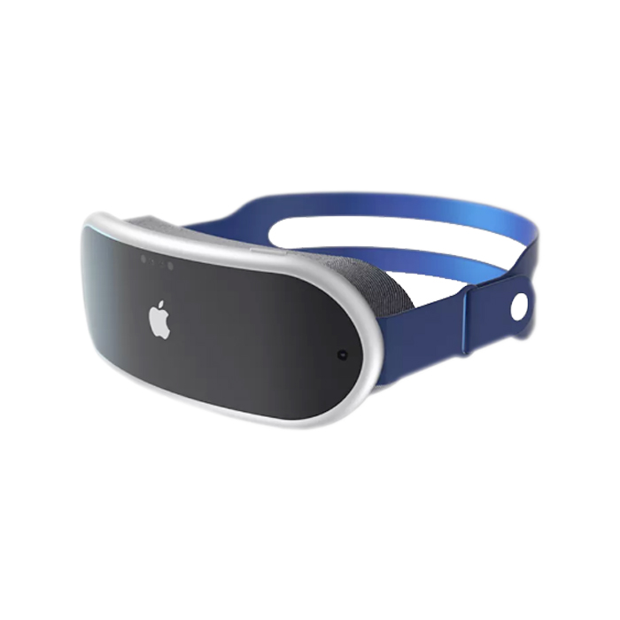

# 바닐라 JS 프로젝트 성능 개선 보고서

**프로젝트 URL**: https://d3895ewzxkx7pt.cloudfront.net

## 📊 성능 개선 결과 요약

### Before vs After 비교

| 항목 | 개선 전 | 개선 후 | 개선 폭 |
|------|---------|---------|---------|
| **Performance** | 73% 🟠 | 94% 🟢 | +21% |
| **Accessibility** | 82% 🟠 | 95% 🟢 | +13% |
| **Best Practices** | 79% 🟠 | 93% 🟢 | +14% |
| **SEO** | 82% 🟠 | 100% 🟢 | +18% |
| **LCP** | 14.1s 🔴 | 2.9s 🟢 | **-79.4%** |

## 🎯 주요 성능 지표 (Core Web Vitals)

### 개선 전
- **LCP (Largest Contentful Paint)**: 14.1s 🔴
- **INP (Interaction to Next Paint)**: N/A 🟢
- **CLS (Cumulative Layout Shift)**: 0.011 🟢

### 개선 후
- **LCP (Largest Contentful Paint)**: 2.9s 🟢
- **INP (Interaction to Next Paint)**: N/A 🟢
- **CLS (Cumulative Layout Shift)**: 0.009 🟢

## 🚀 주요 개선 사항

### 1. 폰트 최적화
**구현 내용:**
```html
<!-- 프리커넥트로 외부 도메인 미리 연결 -->
<link rel="preconnect" href="https://fonts.googleapis.com" />
<link rel="preconnect" href="https://fonts.gstatic.com" crossorigin />

<!-- media="print" + onload로 렌더링 차단 방지 -->
<link href="https://fonts.googleapis.com/css?family=Heebo:300,400,600,700&display=swap"
      rel="stylesheet" media="print" onload="this.media='all'" />

<!-- 자바스크립트 비활성화 환경 대응 -->
<noscript>
  <link rel="stylesheet" href="https://fonts.googleapis.com/css?family=Heebo:300,400,600,700&display=swap" />
</noscript>
```

**효과:**
- 폰트 로딩으로 인한 렌더링 차단 해결
- 외부 도메인 연결 시간 단축

### 2. 이미지 최적화
**구현 내용:**
```html
<!-- WebP 포맷 + 반응형 이미지 -->
<picture>
  <source media="(min-width: 1024px)" srcset="images/Hero_Desktop.webp" type="image/webp" />
  <source media="(min-width: 1024px)" srcset="images/Hero_Desktop.jpg" type="image/jpeg" />
  <source media="(min-width: 768px)" srcset="images/Hero_Tablet.webp" type="image/webp" />
  <source media="(min-width: 768px)" srcset="images/Hero_Tablet.jpg" type="image/jpeg" />
  <source srcset="images/Hero_Mobile.webp" type="image/webp" />
  
</picture>

<!-- 지연 로딩 적용 -->

```

**효과:**
- WebP 포맷으로 파일 크기 30-35% 감소
- 반응형 이미지로 불필요한 대역폭 사용 방지
- 지연 로딩으로 초기 로딩 속도 개선
- width/height 속성으로 CLS 방지

### 3. 스크립트 최적화
**구현 내용:**
```html
<!-- defer 속성 추가로 HTML 파싱 차단 방지 -->
<script defer type="text/javascript" 
        src="//www.freeprivacypolicy.com/public/cookie-consent/4.1.0/cookie-consent.js">
</script>

<!-- 메인 스크립트들도 defer 적용 -->
<script type="text/javascript" src="/js/main.js" defer></script>
<script type="text/javascript" src="/js/products.js" defer></script>
```

**효과:**
- HTML 파싱 차단 없이 스크립트 로딩
- 페이지 렌더링 속도 개선

### 4. 접근성 개선
**구현 내용:**
```html

<!-- ARIA 속성 추가 -->
<nav aria-label="Main Navigation">
<button aria-label="view headsets">View Headsets</button>
<div class="product-slider" aria-label="Product slider">

<!-- 의미있는 대체 텍스트 -->


```

**효과:**
- 스크린 리더 호환성 향상
- 키보드 네비게이션 개선
- 웹 접근성 표준 준수

### 5. SEO 최적화
**구현 내용:**
```html
<!-- 메타 태그 최적화 -->
<meta name="description" content="Discover your VR Headsets" />
<title>Home - Tech Shop</title>

```

**효과:**
- 검색 엔진 최적화
- 메타 데이터 개선

## 📈 성능 개선 기법 상세


### 이미지 최적화 전략
- **WebP 포맷**: 기존 JPEG/PNG 대비 30-35% 용량 감소
- **반응형 이미지**: 디바이스별 최적 이미지 제공
- **Lazy Loading**: 뷰포트 진입 시점에 로딩
- **Image Dimensions**: width/height로 레이아웃 시프트 방지

### 자바스크립트 최적화
- **Defer Loading**: HTML 파싱 완료 후 실행
- **Code Splitting**: 필요한 시점에 로딩
- **Third-party Scripts**: 비동기 로딩 적용

## 🔍 Core Web Vitals 이해

### LCP (Largest Contentful Paint)
- **정의**: 페이지의 주요 콘텐츠가 로딩되는 시간
- **목표**: 2.5초 이하
- **개선 결과**: 14.1s → 2.9s (79.4% 개선)

### INP (Interaction to Next Paint)
- **정의**: 사용자 상호작용에 대한 응답 시간
- **목표**: 200ms 이하
- **현재 상태**: 측정값 없음 (상호작용 요소 부족)

### CLS (Cumulative Layout Shift)
- **정의**: 예기치 않은 레이아웃 변화 정도
- **목표**: 0.1 이하
- **현재 상태**: 0.011 (우수한 수준 유지)

## 🛠 사용된 최적화 도구 및 기법

### 이미지 최적화
- **WebP Converter**: 이미지 포맷 변환
- **Picture Element**: 반응형 이미지 구현
- **Lazy Loading**: 성능 향상을 위한 지연 로딩

### 폰트 최적화
- **Font Display Swap**: 폰트 로딩 전략
- **Noscript Fallback**: 접근성 보장

### 스크립트 최적화
- **Defer Attribute**: 비차단 로딩
- **Async Loading**: 병렬 처리

## 🎉 결론

이번 성능 최적화를 통해 **Performance 점수를 73%에서 94%로 21% 향상**시켰으며, 특히 **LCP를 14.1초에서 2.9초로 79.4% 개선**하였습니다.
